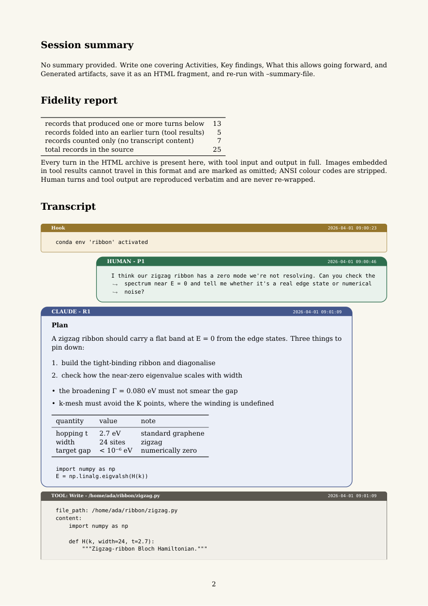

# claude-session-publisher

[](https://github.com/fabiocampolim-design/claude-session-publisher/actions/workflows/tests.yml)
[](https://www.python.org/)
[](transcript_archiver.py)
[](#requirements)
[](LICENSE)

Turn a Claude Code session into a single self-contained document — HTML, plain
text, Markdown, LaTeX or PDF — with a fidelity report proving nothing was
silently dropped.

> **Feedback is highly appreciated.** This tool is young and transcripts are
> wild — if a session of yours renders oddly, a number in the fidelity report
> doesn't reconcile, or a format you need is missing, please
> [open an issue](https://github.com/fabiocampolim-design/claude-session-publisher/issues).

**Why this exists.** AI-assisted research needs the same standard of record
as any other method: when a result was reached in conversation with a model,
the transparency and reproducibility of the science depend on being able to
cite and audit that conversation — verbatim, complete, and in a form a paper
can reference. That is what this tool is for. *But* building it also taught
us that the records themselves are fragile: in August 2026 a Claude Desktop
reinstall — advised by support after a plan-upgrade failure — deleted my
local agent sessions, and the account data export turned out not to include
them. Whole projects, gone for good. So the tool is of wider interest than
science: anyone whose conversations matter should hold their own copy.
The motto: **archive early, archive often** — an archive only exists if you
make it while the files still do.

Claude Code writes every session to a JSON Lines file under
`~/.claude/projects/`. That file is complete but unreadable: interleaved
records, tool payloads, harness bookkeeping. This script parses every record
type into a typed model, decides per class whether to **render**, **fold** or
**count** it, and prints a fidelity report reconciling the three against the
source record count — so the difference between *"not in the transcript"* and
*"not in the source"* is always visible on the page.

Single file, standard library only, no install step.

```bash
python transcript_archiver.py <session-id>
python transcript_archiver.py <session-id> --format html,text,markdown,latex,pdf
python transcript_archiver.py --index          # rebuild the index page
```

Full reference: [`docs/USER_MANUAL.md`](docs/USER_MANUAL.md) (also as
[HTML](docs/USER_MANUAL.html) and [PDF](docs/USER_MANUAL.pdf)) lists every
option, output, feature and known limitation. Driving it with an AI agent?
Hand it [`AGENTS.md`](AGENTS.md). Changes are in [`CHANGELOG.md`](CHANGELOG.md); how to contribute is in [`CONTRIBUTING.md`](CONTRIBUTING.md) and the design trade-offs in [`docs/DESIGN.md`](docs/DESIGN.md).

## Features

- **Five formats from one parse** — HTML, plain text, Markdown, LaTeX and PDF
  all render from the same typed transcript model, so a turn cannot appear in
  one format and vanish from another. `--fragment` emits a LaTeX body ready to
  `\input` into a manuscript, transliterated to compile under pdflatex as well
  as XeLaTeX.
- **Subagent transcripts are part of the record** — a background agent's
  conversation (`<session-id>/subagents/agent-*.jsonl`) is rendered as a
  linked appendix in every format, its usage merged into the cost table, and
  each file listed in the fidelity report. `--subagents off` suppresses the
  content but never the disclosure.
- **Three sources** — Claude Code sessions, Claude Desktop cowork
  (local agent mode) sessions via `--cowork-root`, and claude.ai
  conversations via `--import-claude-ai conversations.json` (from Settings →
  Privacy → Export data), all through the same pipeline and fidelity
  reporting.
- **A fidelity report on every page** — each source record is rendered, folded
  into an earlier turn, or counted as deliberately not rendered, and the three
  numbers are reconciled against the source record count. Corrupt lines are
  counted too. If anything escapes the parser, the page says so instead of
  hiding it.
- **Human turns are verbatim** — typed text and pastes are never run through a
  markdown renderer, so a pasted traceback or columnar benchmark stays
  byte-for-byte intact in every format.
- **Citable reference tags** — every prompt is P1, P2, … and every response
  R1, R2, …, sequential and unique within the document (subagent turns are
  prefixed A1., A2., …), so a paper can say "in prompt P32" or "in response
  A2.R4". Tags appear beside the speaker label in all formats and are anchors
  in the HTML (`#P32` deep-links to the prompt).
- **Session-chain resolution** — a resumed or bridged conversation is written
  to a new file repeating the earlier records; the archiver finds the most
  complete file by comparing record-uuid sets, follows genuine continuations,
  and refuses to follow forks.
- **Usage and cost accounting** — tokens per model, deduped per `requestId`
  (naively summing the records over-reports output ~2.3× on tool-heavy
  sessions), with cache reads, 5-minute vs 1-hour cache writes, and a
  list-price cost estimate — **beside Claude Code's own reported cost** from
  its `cost-state` meter (Claude Code ≥ 2.1.9x), summed over the session's
  runs and gathered across a resumed session's files, and flagged *partial*
  when the session began before its first metered run.
- **The harness is visible** — hook output, injected files, skill loads,
  compaction summaries and system records render in a collapsed lane with the
  classification evidence for each, instead of vanishing or masquerading as
  things you typed.
- **Honest about thinking** — Claude Code requests thinking with
  `display: "omitted"`, so the archive shows *that* Claude thought at a given
  point and says plainly that the text never reaches the transcript.
- **Self-contained HTML** — chat-style layout, light and dark themes with a
  toggle the browser remembers, a search box that hides non-matching turns,
  filterable table of contents, per-lane toggles, keyboard navigation, no
  external assets. `--paginate N` splits a very large session into pages of N
  turns, with the sidebar contents and subagent links pointing across pages.
- **A live index with search across every archive** — `--index` builds a
  sortable page of every session on disk with an activity column whose ages
  decay in the browser without regeneration, and a search box over **every
  prompt of every archive** (embedded at index time, deep-linking to the
  prompt's `#P` anchor on its page); `--index --watch 300` keeps regenerating
  it on a loop and the page reloads itself, giving a slow-paced dashboard of
  which conversations are active right now.
- **Four more languages for the page furniture** — `--lang pt-BR|es|de|fr`
  (or `CLAUDE_ARCHIVE_LANG`) puts the archiver's own words — labels,
  headings, notes, the fidelity report, the index — in Brazilian Portuguese,
  Spanish, German or French, in every format. The conversation is never
  translated: prompts, answers, tool I/O and system text are the same bytes
  whatever the language, and the suite proves it fragment by fragment.
- **Tool I/O under your control** — `--tool-output on|off` independent of
  format, and long outputs elided in the middle (`--full` to keep everything),
  with every elision counted on the page.
- **Survives real transcripts** — NUL bytes from UTF-16 console captures,
  ANSI codes, emoji, 65,000-character lines, unresolved tool calls and
  unparseable lines are all handled, counted, and reported.
- **Every run is on the record** — `--verbose`/`--quiet` for the console, and
  an audit log per invocation under `<archive-dir>/logs/` (exact command
  line, versions, every message, outcome), `--log-dir` to move it.
- **What compiles is checked, not just what exits 0** — the LaTeX path splits
  oversized turns and chunks long or wide tables so nothing runs off the page,
  and the suite compiles a table-heavy session and counts the pages to prove
  the rows arrived. A clean exit code is not evidence the content survived
  the typesetter.
- Standard library only, one file, 443 checks in the test suite, pyflakes and
  CI on Linux/Windows/macOS.

## How this compares

[simonw/claude-code-transcripts](https://github.com/simonw/claude-code-transcripts)
is the best-known tool in this space: pip-installable, with an interactive
session picker, paginated mobile-friendly HTML, git-commit timelines, and
one-command publishing to a GitHub Gist. Other exporters
([claude-session-exporter](https://github.com/rubicon/claude-session-exporter)
and several like it) target Markdown for note vaults. This tool's focus is
different: **archival fidelity and print** — the reconciled fidelity report,
verbatim human turns, usage/cost accounting, chain resolution, and
LaTeX/PDF output fit for a paper's appendix. If you want a quick shareable
web link, use Simon's tool; if you want a complete, auditable record or a
document, use this one.

## Roadmap

Gaps worth closing:

- **First-class Linux and macOS support.** CI runs the suite on Linux and
  macOS. Linux had its first real-world run on 2026-08-31 (WSL2 Ubuntu,
  Python 3.14): HTML, text, Markdown and LaTeX of a real session, `--index`
  over 88 sessions, and the no-`xelatex` failure path all behaved as on
  Windows. Still unverified in the field: PDF compilation and TeX font paths
  on Linux, cowork sessions produced on Linux, and everything on macOS.
  Reports from Linux/Mac users are especially welcome.
- **Scale.** Every run re-reads every transcript under the roots to resolve
  chains, and the index compares uuid sets pairwise — fine for hundreds of
  sessions, slow for thousands. A cached scan is the obvious next step.
- **Search covers prompts, not responses, across archives.** The index
  searches every human prompt of every archive; Claude's responses are
  searchable within a page. Indexing responses too means a much larger
  index file and is deferred until someone needs it.

(Subagent rendering, the Markdown format, cowork discovery, the claude.ai
importer, pagination, per-page search and cross-archive prompt search,
formerly listed here, shipped. Every feature and every known limitation is
listed in one place in the [user manual](docs/USER_MANUAL.md).) Two caveats on the
sources: the cowork directory layout follows Claude Desktop's documented
structure but was tested against synthetic data, and the claude.ai importer —
now validated against a real August 2026 export (fidelity report reconciled
exactly, accented UTF-8 intact) — targets the export schema as of mid-2026;
that export contained no in-project conversations, so reports of exports that
parse differently, project chats especially, remain welcome.

## Where files go

Input is discovered under `--projects-root` (default `~/.claude/projects`)
and, when the directory exists, `--cowork-root` (auto-detected per platform).
Output lands in `--archive-dir` (default `~/claude-archives`, or the
`CLAUDE_ARCHIVE_DIR` environment variable): each session becomes
`<session-id>_<title-slug>.<ext>` there, one file per format (claude.ai
imports use the conversation's uuid prefix), `--index` writes `index.html`
into the same directory, and each run leaves an audit log in `logs/`. To
place a single archive exactly, `--out path/to/report` names the stem —
every format adds its own extension.

## Scope

The archiver reads the transcript files Claude Code writes to your disk, so
what it can archive is decided by where a session's transcript lives:

| Claude surface | Archivable? |
|---|---|
| Claude Code CLI | **Yes** — its native format. |
| Claude Code desktop app | **Yes** — sessions run locally and write the same files. |
| Claude Code web/mobile, bridged to your machine | **Yes** — the local side writes a transcript, and bridge records are chain-resolved so the pieces come out as one conversation. |
| Claude Desktop cowork (local agent mode) | **Yes** — same format under a different base directory, merged into discovery via `--cowork-root` (auto-detected). |
| claude.ai chats, Claude Desktop chat, mobile app | **Via export** — request your data export (Settings → Privacy → Export data) and run `--import-claude-ai conversations.json`. The export carries no token usage and no model names, and the page says so. |
| Claude Code cloud sessions (never bridged) | No — nothing is written to your disk. |

Two hard-won facts from validating against a real account (August 2026): the
claude.ai data export contains **standalone chats only** — conversations
inside claude.ai Projects and Claude Desktop cowork sessions are not in it —
and the local cowork store does **not** survive an app reinstall — see *Why
this exists* at the top.

## Try it

A fully invented showcase conversation ships in `examples/` — a zero-mode
hunt in a graphene nanoribbon, built to exercise everything: reference tags
across two models, a failing tool call and its retry, a verbatim pasted
table, a pasted image, Greek and box drawing, a background subagent
(tagged `A1.*`), a context compaction, an unresolved tool call and one
deliberately corrupt line the fidelity report counts.

```bash
python transcript_archiver.py 0000c0de-cafe-4000-8000-00000000f00d \
    --projects-root examples --archive-dir demo --format html,markdown,pdf
```



## Formats

| | |
|---|---|
| `html` | Chat-style page: your turns right, Claude's left, collapsible tool I/O, filterable table of contents, light and dark themes. Self-contained — no external assets. |
| `text` | Plain UTF-8. Human turns and tool output are reproduced byte-for-byte and never re-wrapped. |
| `markdown` | For note vaults (Obsidian etc.). Claude's prose is markdown and passes through live; human turns and tool I/O are fenced verbatim, with fences sized past any backtick run inside them. |
| `latex` | A standalone XeLaTeX document, or with `--fragment` a body you can `\input` into your own paper. |
| `pdf` | The LaTeX compiled with `xelatex` (two passes, for the table of contents). |

All five render from the same parsed transcript, so a turn cannot appear in one
format and vanish from another, and each states in its own header what its
medium cannot carry.

### Language

`--lang pt-BR|es|de|fr` translates only what the archiver itself writes;
the conversation stays verbatim, the audit log stays English. Details in the
[manual](docs/USER_MANUAL.md#language).

### Tool output

`--tool-output on|off` is independent of `--format`. Tool arguments are
pretty-printed everywhere, but full input and output turns a large session into
a several-hundred-page document, so:

```bash
# a readable PDF: tool calls listed by name, payloads omitted
python transcript_archiver.py <id> --format pdf --tool-output off

# the complete record
python transcript_archiver.py <id> --format html --tool-output on
```

A 1,655-record session is 92 pages with tool output off and 260 with it on.

### Fragments for a paper

`--fragment` emits the body with no preamble, and transliterates every
character so it compiles under **pdflatex** as well as XeLaTeX — Greek becomes
math, arrows and box drawing become ASCII. Your host preamble needs:

```latex
\usepackage{fvextra} \usepackage{xcolor} \usepackage{enumitem}
\usepackage{booktabs} \usepackage{array} \usepackage[most]{tcolorbox}
```

The turn environments are defined with `\@ifundefined`, so you can restyle
every turn from your own preamble without editing the generated file.

## What it gets right

These were all real defects found by running it over hundreds of thousands of
records, and each is now covered by a test:

- **Usage is deduped per `requestId`.** One API response is written as several
  records that each repeat the same cumulative usage; summing them over-reports
  output tokens by roughly 2.3× on a tool-heavy session.
- **Human vs injected is read from `promptSource`/`origin.kind`**, not guessed
  from the text, so harness-injected prompts are not rendered as things you
  typed.
- **Session chains are resolved.** A resumed or bridged conversation is written
  to a *new* file that repeats the earlier records, so archiving the id you
  happen to name can capture half a conversation. Compare uuid sets, not
  filenames or record counts — the shorter file can hold more conversation.
- **Human turns are never run through the markdown renderer.** They are typed
  text and pastes; interpreting them collapses a pasted traceback into prose.
- **Thinking blocks are always empty.** Claude Code requests them with
  `display: "omitted"`, so an archive can show *that* Claude thought at a given
  point, never what it thought. The page says so rather than implying otherwise.

## Tests

```bash
python tests/test_archiver.py
```

443 checks, run against the synthetic sessions in `examples/` —
self-contained, no real transcript needed. The LaTeX/PDF compile checks are
skipped (not failed) when no TeX installation is on `PATH`; everything else
needs only Python. The suite also verifies that the user manual and
`AGENTS.md` document every CLI flag and that the check count stated here is
current. To exercise it on a large messy conversation of your own:

```bash
CLAUDE_PROJECTS=~/.claude/projects SAMPLE_SESSION=<id> python tests/test_archiver.py
```

The sample is generated by `examples/make_sample.py` and is deliberately built
to carry the things that broke on real data: a pasted block whose columns must
not be re-wrapped, Greek and box drawing, NUL bytes from UTF-16 output captured
byte-wise, a 3,000-character line, an empty thinking block, an unresolved tool
call, a markdown list that switches marker type mid-stream, a turn quoting the
archiver's own template placeholders, and one deliberately corrupt line the
fidelity report must count rather than silently skip.

## Requirements

Python 3.9+ for the HTML and text formats — standard library only.

LaTeX and PDF need a TeX installation providing `xelatex`, `fvextra`,
`tcolorbox`, `array` and the DejaVu fonts (TeX Live's `scheme-full` has all
of them).
Fonts are loaded **by filename from TeX Live**, not from the system, so output
does not depend on the machine's font database.

Cost figures come from the `PRICING` table at the top of the script — public
list rates, hardcoded as of August 2026. When rates change, edit that table;
models it does not know are reported as "no list price" rather than priced
wrongly.

## How it was built

With itself watching, in a sense: the whole tool was developed in Claude Code
(Opus 5 and Fable 5), and every one of those development sessions is archivable
by the result. The effort, reconstructed from the session transcripts: **ten
days from first prototype to release** (August 16–26, 2026), across roughly
eight long working sessions — some 40 MB of raw transcript — and 15 commits.
The first public commit landed only on day nine — everything before that was
survival testing. Two more days of review-driven releases followed (2.4 →
2.6.6, August 28–31: three full project reviews, an independent code-review
pass, survival runs that caught six new record types Claude Code had started
writing, and the fixes each of those demanded — the last of them a table that
compiled cleanly while dropping its rows), bringing the history to
38 commits; the housekeeping that followed — keeping the vendored conformance
checker byte-identical to the publishing playbook — brings it to 56 commits (2.7.2, a regression the real-data survival run caught after an all-green suite, 2.7.3–2.7.5, three rounds of independent review of its failure path, and 2.7.6, the review that followed the whole file line by line, are the last five).

The division of labour, reconstructed from those same transcripts and stated
in [CRediT](https://credit.niso.org/) terms (the contributor-roles taxonomy
scientific papers use):

| CRediT role | Fabio | Claude |
|---|---|---|
| **Conceptualization** | The premise — a full-fidelity, self-contained record of an AI-assisted session, fit for scientific reporting — and most feature ideas: P/R citation tags, the tool-output switch, the live-activity index, pagination | The render/fold/count reconciliation model that became the fidelity report |
| **Methodology** | The priority order (content fidelity first, then sources, then formats); the academic-publishing requirements that shaped the LaTeX fragment | Chain resolution by uuid-set comparison; per-`requestId` usage dedup; the verbatim-human-turn rule |
| **Software** | — | All of it |
| **Validation** | Broke every build against hundreds of thousands of records from a real archive; caught the stale-page, overflow and layout defects; set the bar (*"this needs high accuracy"*); commissioned the review and code-review passes | The 296-check test suite and CI; the review-driven survival runs |
| **Investigation** | Directed the survey of neighbouring tools | Code and documentation analysis for the comparison section |
| **Data curation** | — | The synthetic sample and the showcase conversation, built to carry exactly the cases that had broken on real data |
| **Visualization** | The chat layout (human right, Claude left), box styling, tag and timestamp placement | The HTML/CSS realising it |
| **Writing** | Review and editing | Original draft (README, commit messages) |
| **Resources · Supervision · Project administration · Funding acquisition** | All | — |

## Licence

Apache License 2.0 — see `LICENSE` and `NOTICE`. You may use, modify and
redistribute it, including commercially, provided the licence and notice
travel with it; contributions are accepted under the same terms (section 5).

### Disclaimer

This software is provided **as is**, without warranties or conditions of any
kind, express or implied, including but not limited to any warranty of
merchantability, fitness for a particular purpose, title or non-infringement.
In no event shall the author be liable for any damages of any character —
direct, indirect, special, incidental or consequential — or for any other
claim or liability, whether in contract, tort or otherwise, arising from,
out of or in connection with the software or its use, even if advised of the
possibility of such damages (Apache License 2.0, sections 7 and 8).
You alone are responsible for using it lawfully, for the transcripts and
data you feed it and publish with it, and for complying with the terms of
any third-party service or content it touches.

This is an independent project. It is not affiliated with, endorsed by or
supported by Anthropic; *Claude* and *Claude Code* are trademarks of
Anthropic, PBC, used here only to name the software whose transcripts this
tool archives.
